# RollChain 设计文档
## 前言
一个完整的底层基础链包括分布式网络，账户系统，交易处理和区块共识四个功能。区块上传递的信息包括Token, 智能合约（脚本），交易，区块以及其他上链的记录等，为应对未来区块链的发展，要求基础链具备可扩展，灵活性等要求，需要从模块化，层次化和接口化的角度去考虑整体设计。同时考虑到本基础链支持币回滚的业务场景，本文从架构层面，数据结构层面以及币回滚交易流程几个方面进行了阐述

## 架构设计

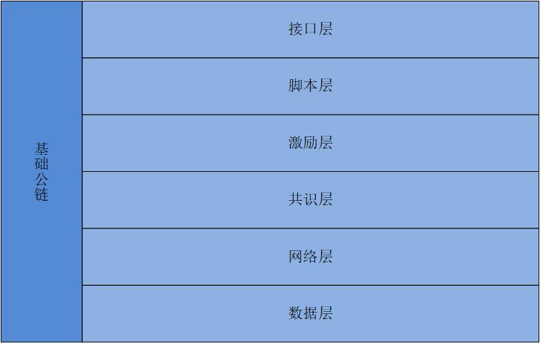

- 接口层
	> 提供基础主链的用户操作接口，实现用户功能性调用接口
		
- 脚本层
	> 提供对交易合法性的支持，以比特币脚本虚拟机为基础，支持交易撤回功能
		
- 激励层 
	> 提供挖矿奖励，普通交易费奖励，撤回交易，清算交易等奖励机制
		
- 共识层
	> 处理区块共识，账户共识，交易共识等。区块共识方面，采用poa模型	
		
- 网络层
	> 实现基础网络P2P协议，提供网络节点之间数据传输和通讯，以libp2p为基础
		
- 数据层  
	> 包括区块数据，交易数据和账户数据，以及其他区块链系统中的基础数据结构。  
		区块:POA区块  
		交易:支持可撤回功能的交易  
		账户:UTXO+MPT账户树

## 数据设计
### 区块结构

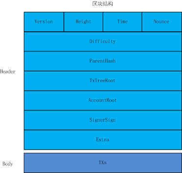

### 交易结构

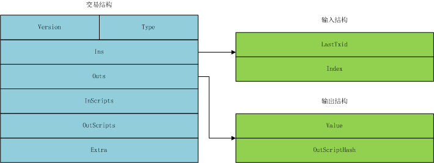	
## 交易模型

### 普通交易
1. 输入
	- 输入脚本:P2PKH的解锁脚本
			
			<Sig> <PubKey>
	
2. 输出

	- 输出地址:普通账户地址
	
	- 输出脚本:P2PKH的锁定脚本
	
			OP_DUP OP_HASH160 <PubkeyHash> OP_EQUALVERIFY OP_CHECKSIG 
3. 类型:0x00

### 保险账户创建交易
1. 输入
	- 输入脚本:P2PKH
			
			<Sig> <PubKey>
	
2. 输出

	- 输出地址:保险账户地址
	
	- 输出脚本:P2PKH锁定脚本 + OP_CREATE_INSURANCE + SECURITY_ADDRES + CLEAR_TIME
	
			P2PKH锁定脚本
	- 备注：
			
			该脚本只列举出重要脚本代码，不能直接使用需要对脚本进行完善
			
3. 类型:0x01
			
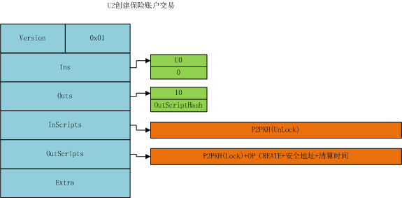
	
### 保险账户转入交易
1. 输入
	- 输入脚本: P2PKH的解锁脚本（普通地址）
			
			<Sig> <PubKey>
	
2. 输出

	- 输出地址:保险账户地址
	
	- 输出脚本:P2PKH锁定脚本
	
			OP_DUP OP_HASH160 <PubkeyHash> OP_EQUALVERIFY OP_CHECKSIG
			
3. 类型:0x02

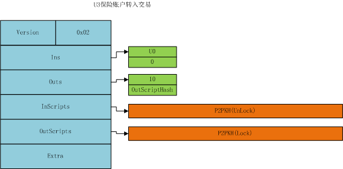

### 保险账户转出交易
1. 输入
	- 输入脚本: P2PKH的解锁脚本（普通地址）
			
			<Sig> <PubKey>
	
2. 输出

	- 输出地址:保险账户地址
	
	- 输出脚本:P2PKH锁定脚本+延迟到账时间检测
	
			OP_DUP OP_HASH160 <PubkeyHash> OP_EQUALVERIFY OP_CHECKSIG OP_CHECK_DELAY_TIME
			
	- 备注
			
			当用户使用这个票据时，不仅需要检查签名是否正确，还需检查是否达到延迟到账时间，延时到账时间不能有交易交易创建者输入，而是由脚本验证引擎感知到账时间通过。
			
3. 类型:0x03

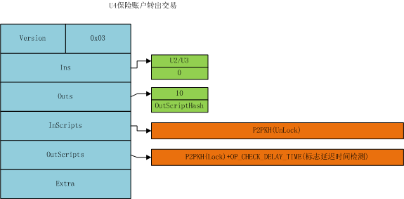
### 撤回交易
1. 输入
	- 输入脚本: P2PKH的解锁脚本
			
			<Sig> <PubKey> OP_CHECK_LAST_LOCK_SCRIPT
	
	- 备注
	
			OP_CHECK_LAST_LOCK_SCRIPT 标志检测保险账户签名。
			
			当私钥被盗/用户转错账,这是保险账户票据A被销毁，新的票据B生成。这是用户发起撤回交易，撤回交易的输出必须为安全账户地址，撤回交易的输入是票据B,但是由于票据B的锁定脚本用户不一定解开。因此输入脚本需要 OP_CHECK_LAST_LOCK_SCRIPT，把原先应该检测票据B的锁定脚本，替换为票据A的锁定脚本。
	
	- 脚本数据
			
			<Sig> <PubKeyA> OP_CHECK_LAST_LOCK_SCRIPT OP_DUP OP_HASH160 <PubkeyHashB> OP_EQUALVERIFY OP_CHECKSIG
			
	- 运行过程
			
			签名入栈
			公钥入栈
			检测到OP_CHECK_LAST_LOCK_SCRIPT 使用票据A的锁定脚本 
			OP_DUP OP_HASH160 <PubkeyHashA> OP_EQUALVERIFY OP_CHECKSIG
			普通P2PKH的脚本验证

2. 输出

	- 输出地址:安全账户地址
	
	- 输出脚本:P2PKH锁定脚本
	
			OP_DUP OP_HASH160 <PubkeyHash> OP_EQUALVERIFY OP_CHECKSIG
			
3. 类型:0x04

### 清算交易
1. 输入
	- 输入脚本: P2PKH的解锁脚本
			
			<ClearerSig> <ClearerPubKey> OP_CHECK_CLEARER_SIGN
	
	- 备注
	
			该脚本只列举出重要脚本代码，不能直接使用需要对脚本进行完善
			OP_CHECK_CLEARER_SIGN 标志检测清算保险账户者的签名。
			
			清算交易时,输入脚本需要添加清算者的签名和公钥
			1. 首先检测验证清算者是否为保险账户（如何检查，<ClearerSig> <ClearerPubKey>+锁定脚本 进行普通P2PKH验证）
			2. 当验证不过时，检测清算者是否为矿工，验证签名 （<ClearerSig> <ClearerPubKey> + txid） 。然后验证ClearerPubKey是否为矿工公钥。
	
2. 输出

	- 输出地址:安全账户地址
	
	- 输出脚本:P2PKH锁定脚本
	
			OP_DUP OP_HASH160 <PubkeyHash> OP_EQUALVERIFY OP_CHECKSIG
		
3. 类型:0x05

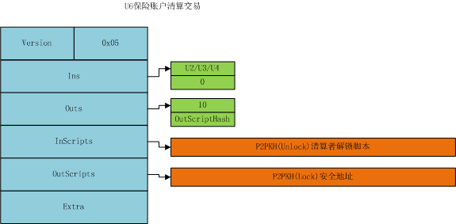

### 设置清算时间交易
1. 输入
	- 输入脚本: P2PKH的解锁脚本（普通地址）
			
			<Sig> <PubKey>
	
2. 输出(找零)

	- 输出地址:保险账户地址
	
	- 输出脚本:P2PKH锁定脚本+延迟到账时间检测
	
			OP_DUP OP_HASH160 <PubkeyHash> OP_EQUALVERIFY OP_CHECKSIG OP_CHECK_DELAY_TIME
			
	- 备注
			
			1.清算时间交易被打入区块链中后，账户状态树需记录正在修改清算时间，表明在延迟时间前都无法再次进行设置清算时间，清算动作停止。

3. 类型:0x06

	
## 交易可撤回功能流程
### 保险账户票据的来源(创建+充值)
	
保险账户票据来源:
	
1. 创建保险账户交易，在创建保险交易是需要输入保险账户关联的安全地址与保险账户清算时间。

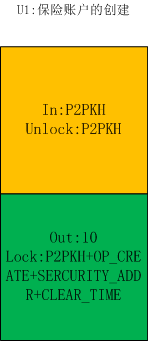

2. 转入保险	账户交易，转入保险账户交易，从脚本层面上说，和普通交易没有区别。都是P2PKH

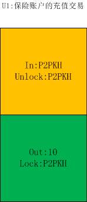

### 保险账户票据的花费(转出)

花费的保险账户的票据有两种:

	1. 创建的票据
	2. 转入的票据

两个交易的输出都带有延迟时间属性,当需要花费掉保险账户转出的票据时，需要判断延迟时间是否到达，如到达才能花费这笔票据。

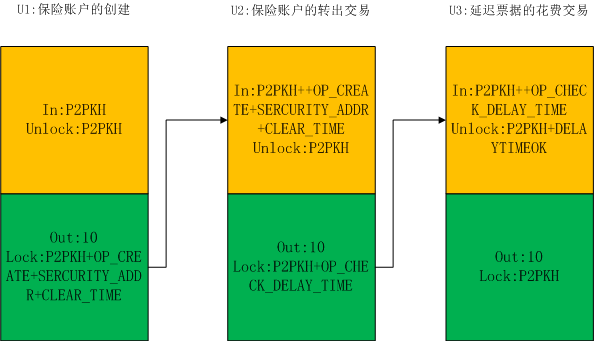

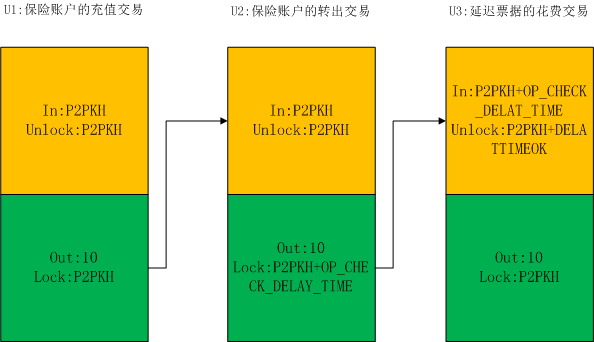

### 保险账户转出后撤回(撤回)

当保险账户转出一笔交易后，如果需要撤回，需要创建撤回交易，撤回交易输入为保险账户全部输出票据。撤回交易的解锁脚本为保险账户签名。

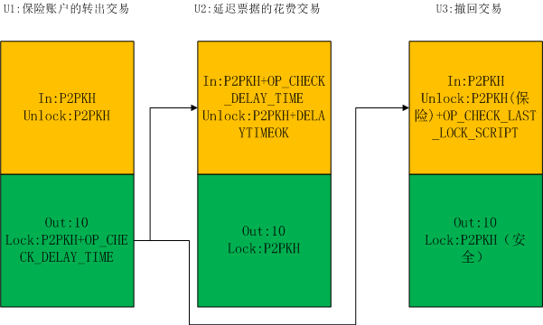

### 保险账户的清算(清算)

当保险账户到达清算时间后，矿工/保险账户均可发起清算交易。清算交易的输入为保险账户全部票据，输入的解锁脚本为清算者的签名。输出一定是安全地址。

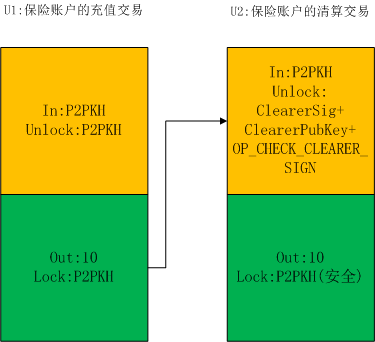

### 保险账户的清算时间设置(设置)

当保险账户修改清算时间，保险账户创建设置清算时间交易。该交易类似于保险账户清算交易。当时全部输出地址必须为保险账户地址。

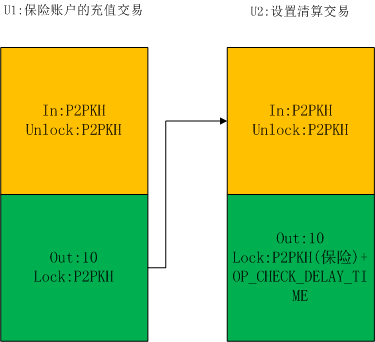
